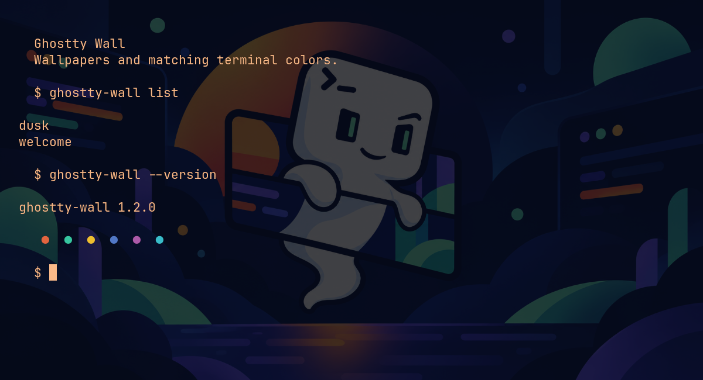
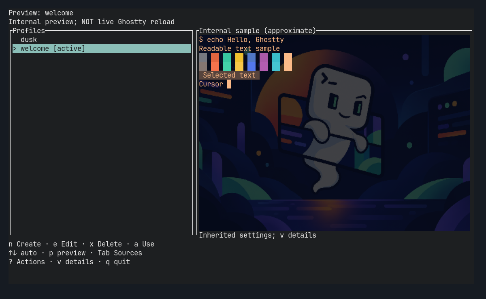

# Ghostty Wall

Set a Ghostty wallpaper, generate matching terminal colors, and save looks you can switch between.



*Real Ghostty window using the bundled `welcome` profile.*



*Profile browser running in Ghostty. Internal preview, not live Ghostty reload.*

## Install — Linux x86_64

Requires Ghostty, Bash, curl, tar and sha256sum. No Rust toolchain needed.

[Inspect the installer](scripts/install-release.sh) before running it:

```bash
curl -fsSL https://raw.githubusercontent.com/GiovanniCaiazzo01/Ghostty-wall/main/scripts/install-release.sh | bash
```

Installs the latest stable release into `~/.local/bin` and verifies its SHA-256 checksum. Make sure that directory is on your PATH. [Installation help and PATH conflicts](https://giovannicaiazzo01.github.io/Ghostty-wall/installation/).

Linux x86_64 is supported. macOS is experimental with no supported installer; other Linux architectures have no supported installer. Windows is unsupported. The curl installer is the supported installation route.

## Quick start

```bash
ghostty-wall init
ghostty-wall apply welcome
ghostty-wall create
```

The first two commands try the bundled wallpaper. `create` lets you generate a wallpaper or choose your own PNG/JPEG, then save and optionally use it. If Ghostty does not change, reload its configuration manually.

Run `ghostty-wall` to browse your saved looks. Select a profile to preview it; choose **Use** to apply it. Create/Edit drafts offer `s` **Save** without applying, `u` **Save and use** with confirmation, and Esc/`q` **Cancel**. Editor and browser samples are internal previews, not live Ghostty reload.

[Watch the short browser walkthrough](media/screenshots/profile-browser.gif) (captured frames from a real Ghostty window; internal previews, not live wallpaper switching).

## Useful commands

```bash
ghostty-wall edit           # Customize a saved look
ghostty-wall previous       # Restore the previous look
ghostty-wall update         # Update Ghostty Wall, not Ghostty
ghostty-wall uninstall      # Remove integration; keep profiles and history
```

## Documentation

- [Quick start](https://giovannicaiazzo01.github.io/Ghostty-wall/quick-start/)
- [User guides and command reference](https://giovannicaiazzo01.github.io/Ghostty-wall/)
- [Troubleshooting and recovery](https://giovannicaiazzo01.github.io/Ghostty-wall/troubleshooting/)
- [Advanced behavior and safety notes](docs/advanced-usage.md)
- [Changelog](CHANGELOG.md)

MIT — see [LICENSE](LICENSE).
